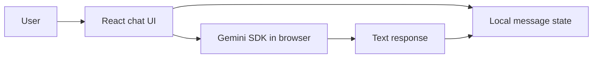

# Chatbot Mohamed

An Arabic conversational-interface prototype built with **React**, **TypeScript**, and **Vite**. The browser UI sends messages to Gemini with a fixed Arabic system instruction and renders the conversation locally.

> **Project status:** Client-side AI prototype. The audited production build succeeds, but the project has no automated test suite and does not have a verified public deployment listed in this README.

## Verified capabilities

- Arabic right-to-left chat interface.
- Local message history maintained in React state.
- Gemini text generation through `@google/genai`.
- A fixed system instruction that frames the assistant as a professional Arabic guide.
- Loading and error states for model requests.

## Architecture



`App.tsx` composes the user interface, while `services/geminiService.ts` initializes the Gemini client and submits chat history. There is no inspected server-side API, database, authentication layer, or persistent conversation store.

See [`docs/ARCHITECTURE.md`](./docs/ARCHITECTURE.md) for the current implementation boundary.

## Tech stack

| Area | Verified technology |
|---|---|
| UI | React 19, TypeScript |
| Build tooling | Vite |
| AI integration | `@google/genai` |
| Styling | Tailwind CSS CDN and Cairo font |
| State | In-memory React state |

## Local setup

### Prerequisites

- Node.js 20 or later is recommended.
- A Gemini API key for controlled local development.

Install dependencies:

```bash
npm ci
```

Create `.env.local`:

```bash
VITE_GEMINI_API_KEY=replace-with-your-local-development-key
```

Start the development server:

```bash
npm run dev
```

Build the application:

```bash
npm run build
```

## Quality checks

```bash
npm run typecheck
npm run build
npm run check
```

No unit, integration, or end-to-end tests are present today. A successful type check and build do not verify model quality, user safety, accessibility, or public deployment behaviour.

## Security and deployment boundary

A `VITE_` environment variable is deliberately exposed to browser code by Vite. Therefore, the current direct-provider pattern must not be used to ship a long-lived secret API key in a public deployment.

Do not commit credentials. Before public deployment, move Gemini calls to a server-side endpoint, keep provider credentials on the server, add request limits and input validation, and define appropriate logging and error handling. See [`docs/SECURITY.md`](./docs/SECURITY.md).

## Deployment

No functioning public demo was verified during this review, so no deployment URL is listed. A demo link should be added only after its URL and server-side key boundary are verified.

## Repository structure

```text
.
├── App.tsx                    # Chat UI composition and state
├── services/geminiService.ts  # Gemini client and request function
├── vite.config.ts             # Vite build configuration
├── package.json               # Scripts and dependencies
└── docs/                      # Architecture and security notes
```

## License

No license file is currently included. Treat reuse rights as unspecified until the repository owner adds one.
