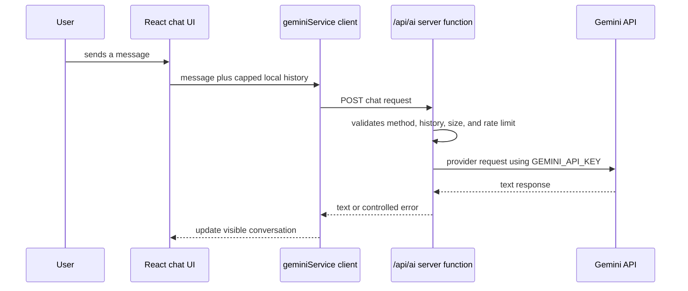

# chatbot-mohamed

An Arabic right-to-left conversational-interface prototype built with **React**, **TypeScript**, and **Vite**. The UI keeps the visible conversation in React state and sends a bounded history to a server-side AI endpoint.

> **Status:** Experimental portfolio project. Local type-check, endpoint tests, and production builds pass in the audited environment. No public deployment is verified, so this repository does not claim a live demo or production usage.

## Engineering focus

The browser no longer creates a provider client or reads a provider key. It sends a supported chat request to `/api/ai`; the server function owns `GEMINI_API_KEY`, validates the request history, limits size and request rate, and returns controlled errors when provider access is unavailable.

| Area | Verified implementation |
|---|---|
| UI | React 19, TypeScript, right-to-left chat interface |
| Build | Vite |
| Conversation state | In-memory React state for the active browser session |
| AI boundary | `api/ai.ts` on the server; `services/geminiService.ts` in the browser |
| Quality checks | TypeScript, Vitest endpoint tests, production build |

## Features

The interface provides Arabic chat, local session history, loading feedback, and controlled error feedback. The browser sends only a capped representation of the active conversation to the server endpoint. The server rejects malformed history and does not return the provider credential to the UI.

## Architecture



The application has no database, user accounts, cross-device history, or verified public deployment. The detailed boundary and explicit limitations are in [`docs/ARCHITECTURE.md`](./docs/ARCHITECTURE.md) and [`docs/SECURITY.md`](./docs/SECURITY.md).

## Local setup

Use Node.js 20 or later.

```bash
npm ci
cp .env.example .env.local
```

Configure a server-only development credential:

```dotenv
GEMINI_API_KEY=replace-with-a-development-key
```

Start the Vite client:

```bash
npm run dev
```

To exercise `/api/ai` locally, use a serverless-runtime-compatible workflow such as `vercel dev` with the same environment variable. Do not use `VITE_GEMINI_API_KEY` and do not embed a provider key in browser code.

## Quality checks

```bash
npm run typecheck
npm test
npm run build
npm run check
```

Current automated tests cover method rejection, malformed-history rejection, and safe failure when the server credential is unavailable. They do not make provider calls, measure response quality, or replace end-to-end and accessibility testing.

## Deployment

The repository is structured for a Vercel-style deployment: Vite creates `dist/`, and `api/ai.ts` is intended to run as a server function. Configure `GEMINI_API_KEY` only as a server runtime variable and build with `npm run build`.

No deployment URL is listed because live deployment behavior has not been verified.

## Repository structure

```text
.
├── api/ai.ts                   # Server-side AI boundary
├── components/Chatbot.tsx      # Chat interface
├── services/geminiService.ts   # Browser client for the chat endpoint
├── tests/                      # Endpoint validation tests
├── docs/                       # Architecture and security notes
├── App.tsx                     # UI composition
└── vite.config.ts              # Client build configuration (no key injection)
```

## License

No license file is included. Reuse rights are unspecified until the repository owner adds one.
