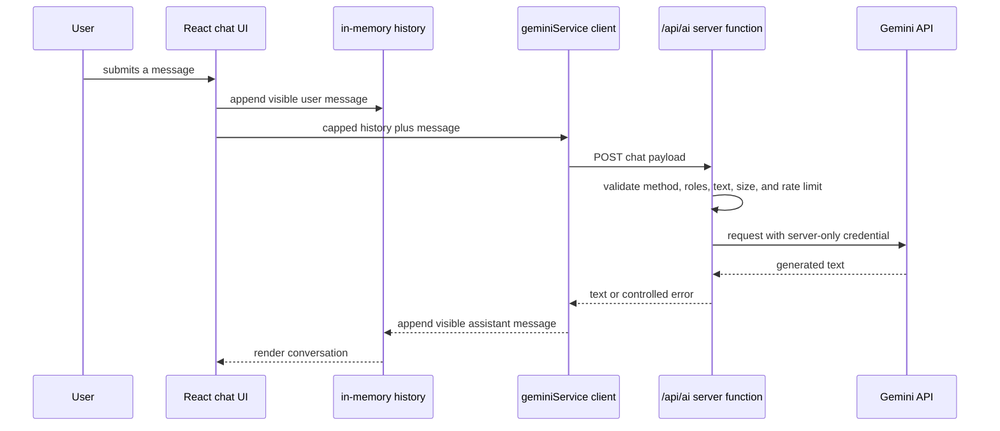

# Architecture

## System boundary

`chatbot-mohamed` is a Vite React interface with an in-memory browser conversation and a separate serverless AI boundary. The browser does not receive `GEMINI_API_KEY` and does not import the provider SDK.

## Responsibilities

| Layer | Verified responsibility | Does not provide |
|---|---|---|
| `components/Chatbot.tsx` | Input, loading/error state, and visible local conversation | Credential access or remote persistence |
| `services/geminiService.ts` | Sends the bounded chat request to `/api/ai` | Direct provider calls |
| `api/ai.ts` | Credential isolation, method and history validation, request limits, provider call, controlled errors | Authentication, account management, or durable storage |
| React state | Current browser-session message history | Persistence across reloads or devices |

## Request contract

Only `POST` requests are accepted. A request contains an action, a non-empty current message, and a bounded list of messages. Every history item must have an allowed role and a non-empty text field within the configured limits. The server limits the retained history before invoking the provider, so a browser cannot make the provider prompt grow unbounded through the normal interface.

## Deployment contract

The Vite build produces `dist/`; `api/ai.ts` is designed for a Vercel-style server function. `GEMINI_API_KEY` must be a server-only deployment variable. The architecture does not establish accounts, a database, moderation policy, distributed rate limits, or a verified production deployment.

## Known limits

The rate limiter is in-memory and applies only to one server-function instance. The system prompt and generated response are application behavior, not a guarantee of safety or accuracy. Conversation history is intentionally not persisted and is lost on page reload.
