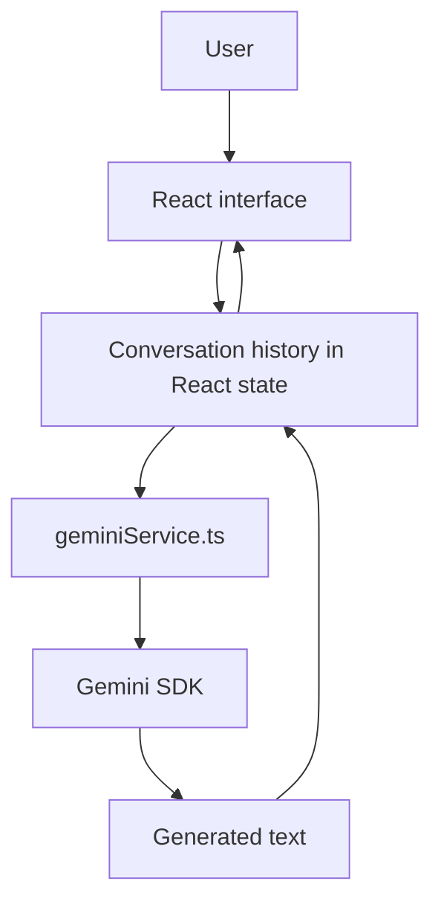

# Architecture

## System boundary

`chatbot-mohamed` is a browser-only React application. The inspected source does not include a backend service, database, authentication flow, server-side provider proxy, or persistent chat history.

## Request flow

1. The user submits a message through the React interface.
2. The application appends it to the in-memory conversation history.
3. `services/geminiService.ts` sends the history to Gemini with a fixed Arabic system instruction.
4. The generated text is appended to local state and rendered in the conversation.
5. Reloading the page clears the conversation because no persistent store is present in the inspected source.

## Provider-key boundary

The integration reads `import.meta.env.VITE_GEMINI_API_KEY`. Vite exposes environment variables prefixed with `VITE_` to browser code, so this is suitable only for controlled local development with a restricted key. It is not a server-side secret boundary.

A production evolution would move Gemini requests to an application server. The server would keep credentials private, accept validated requests, apply rate limits, limit message sizes, and return a defined response shape to the browser. This is recommended future work, not existing functionality.

## Explicitly absent capabilities

The current implementation does not establish user identity, store conversations remotely, provide moderation controls, perform server-side request limiting, or contain automated tests. These features should not be inferred from the chat UI.
